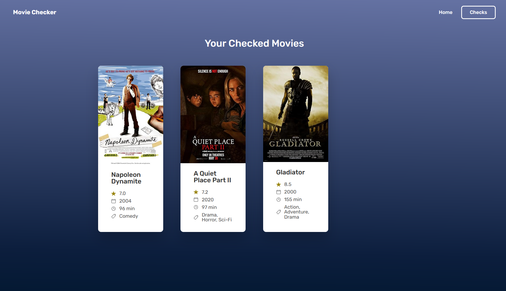

# Movie Checker

A simple website for checking movies you've seen.

Uses React + TypeScript. Data is pulled from OMDB API and the checks are stored in local storage.

# Setup

Add an OMDB API key to src/services/api.ts (currently there is no .env file or backend)

```bash
cd movie-checker
npm install
npm run dev
```

# Screenshots

Home screen with a few selected picks + a search bar


Screen with user's checks


